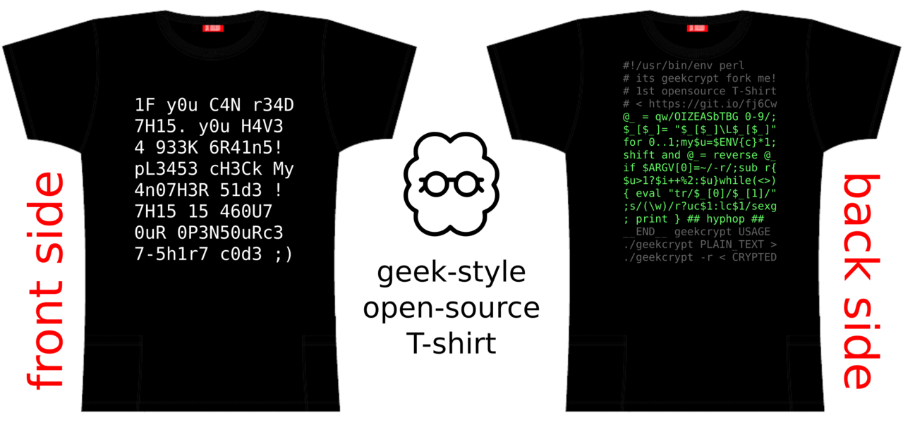

# GeekCrypt - 1st real opensource T-shirt

GeekCrypt - coders fun art project ! 
its a simple brainfuck example and usual fun 4 geeks! 
Fully opensource project! used only opensource tools and apps too!
This 400 bytes - its a first opensource T-shirt code!
Its not a sucks like other! not like just stupid texts like: admin, root@localhost, 127.0.0.1, opensoure, linux ....
Its a **FIRST REAL OPENSOURCE T-SHIRT**, read more about
[how-to build T-shirt from a scratch!](#how-to-build-opensource-t-shirt-from-a-scratch)

## Art



just 400 bytes of pure perl code, 16 lines x 25 rows! 

```
#!/usr/bin/env      perl
# its geekcrypt fork me!
# 1st opensource T-Shirt
# < https://git.io/fj6Cw
@_ = qw/OIZEASbTBG 0-9/;
$_[$_]= "$_[$_]\L$_[$_]"
for 0..1;my$u=$ENV{c}*1;
shift and @_= reverse @_
if $ARGV[0]=~/-r/;sub r{
$u>1?$i++%2:$u}while(<>)
{ eval "tr/$_[0]/$_[1]/"
;s/(\w)/r?uc$1:lc$1/sexg
; print }   ## hyphop ##
__END__  geekcrypt USAGE
./geekcrypt PLAIN_TEXT >
./geekcrypt -r < CRYPTED
```
yeah Perl still a live! and good as always)

## how it works?!

its very easy - just a `echo "its my unique text" | ./geekcrypt`, output this

```
175 my un1qu3 73x7
```

## Fork me 

Fork me on git*, and make your version of your unique opensource T-shirt.

## how-to build opensource T-shirt from a scratch

    git clone https://github.com/hyphop/geekcrypt.git
    cd geekcrypt
    ./geekcrypt.decrypt
    # text/front.txt - edit this input text file
    nano text/front.txt
    ./geekcrypt.make
    # well done!

### output Files

+ [text/crypt.txt](text/crypt.txt) - cool crypted text
+ `pics/geekcrypt.1.svg` - front side
+ `pics/geekcrypt.2.svg` - back side
+ `pics/geekcrypt.1.example.*` - front side example
+ `pics/geekcrypt.2.example.*` - back side example
+ `pics/geekcrypt.example.*`   - both side example
+ [pics](pics) - other files

### files

+ [text](text) - text files 
+ [text/front.txt](text/front.txt) - (non exist there) input original plain text file ( 8 lines x 16 rows  = 128 bytes ) - sure u can chouse any size
+ [geekcrypt](geekcrypt) - encrypt / decrypt tool
+ [geekcrypt.make](geekcrypt.make) - make all shell script
+ [geekcrypt.decrypt](geekcrypt.decrypt) - decrypt script
+ [README.md](README.md) - read me

### buid T-shirt front side

    tee text/crypt.txt | lpr

    1F y0u C4N r34D
    7H15. y0u  H4V3
    4 933K  6R41n5!
    pL3453 cH3Ck My
    4n07H3R  51d3 !
    7H15  15  460U7
    0uR  0P3N50uRc3
    7-5h1r7 c0d3 ;)

### build T-shirt back side

    cat geekcrypt | lpr

## Usage

encrypt mode

    geekcrypt [files]

decrypt mode

    geekcrypt -r [files]


## More usage examples

+ `./geekcrypt text/front.txt > text/crypt.txt` - encrypt file and output to file
+ `./geekcrypt -r text/crypt.txt` - decrypt file and output to terminal
+ `echo h1 | ./geekcrypt -r` - decrypt pipe input and output to terminal
+ `echo hi | ./geekcrypt | ./geekcrypt -r | grep hi && echo ok` - test
+ `echo lower case | c=0 ./geekcrypt` - encrypt in lower case output
+ `echo upper case | c=1 ./geekcrypt` - encrypt in upper case output
+ `echo mixed case | c=2 ./geekcrypt` - encrypt in mixed case output

## Links

+ https://git.io/fj6Cw	- this page short link 
+ https://github.com/hyphop/geekcrypt - this page link

## Requires

`perl`, `sh`, `inkscape` | ImageMagick tools (`convert`)

## License

[LICENSE CC-BY-SA-4.0](LICENSE) 

## Author

    ## hyphop ##
